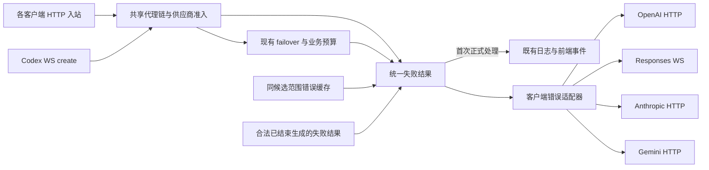

# 通用供应商不可用处理与 Codex WS 恢复修复计划

日期：2026-10-08。源码基线：`d35bc3b3`，AIO `0.60.20`。状态：已按第二轮架构审核实施；本地验证结果及实际 CLI 验收范围见第 8 节。

本次修复让所有已支持客户端获得同一供应商不可用结果：熔断、冷却、限额的判定、原因和恢复时间由共享代理链生成，通过客户端协议适配器返回原生错误格式。Codex WS 的降级与上下文恢复承接这个通用结果和已有预算。供应商不可用期间，即使外部客户端继续请求，网关也必须停止对被拒绝供应商的上游调用。503 可以触发客户端有限重试，但后续恢复校验错误不能覆盖同一合法请求已经确定的失败原因。

共享失败结果与协议适配器已经落地。下文保留实施前的复现证据、两轮审核和设计约束，实施结果单独记录在第 8 节；旧基线测试不作为修复通过的证据。前后端核心流程与跨客户端错误契约测试为必选。

## 1. 已有证据与需要补齐的证据

实施前确认的实现缺口：

- `GatewayErrorResponse` 使用 `error_code/message` 格式；WS 入口只接受顶层 `type=error`，因此会丢失网关错误码、状态及恢复时间，并替换为通用 `upstream_error`。
- 本地 `protocol::error_event` 不包含 `status`，一些不可恢复错误会被客户端按断流恢复。
- 真实 Codex `0.161.0` → AIO 路由、全部供应商熔断、两类客户端重试均设为 0 时：上游调用为 0，但 CLI 的最终错误为 `invalid_request: context recovery ownership mismatch`，而不是供应商不可用。失败生成退役后，客户端回显 nonce 的 HTTP 请求被当作非法恢复，原失败被覆盖。
- 上述真实 CLI 场景的请求日志入队数为 0。预热不记录正式日志，却写入了供应商不可用缓存；正式请求命中该缓存仍不写日志，最终 HTTP 校验拒绝也绕过错误记录。不能把这种“没有活动请求”误当作完整的可观测性。
- 同一真实 AIO 路由中，先强制请求已熔断的 A 返回 503，再取消强制、允许 A/B 时仍返回缓存 503，B 调用为 0；相同供应商状态下，使用无该缓存的路由可以通过 B 返回 200。当前缓存键未包含最终候选范围，且精确请求键同样未区分强制供应商。
- 受控恢复携带“本次生成已失败 A”的 Budget、B 当前熔断时，恢复请求的 503 还会写入共享缓存，使后续新请求误拒绝实际健康的 A。恢复读路径已绕过该缓存，写路径却没有对应限制。因此只修候选键仍不足够。恢复预算全耗尽时现有路由返回 502，此行为正常，应保持。
- `gate::error_response` 把含 `Retry-After: 120` 的 WS 429 error 转为 `UpstreamResponse` 后保留 429，却只生成 Content-Type 响应头。冷却/额度处理与客户端恢复信息因此可能分叉。
- 现有上游传输降级、WS 冷却、供应商熔断、受控恢复预算和错误缓存已经存在，应继续由这些机制承担各自职责。

Codex `0.161.0` 的模拟边界实验显示：在 `request_max_retries=0`、流重试采用默认值时，通用 WS 错误产生 7 次 WS create（含一次预热）和 6 次 HTTP POST；明确的终止性 WS 400 不触发 HTTP 重放；握手 426 会直接促成 HTTP 降级。保留 WS 503 后客户端仍可能重试。

模拟网关计数不能当作真实 AIO 的完整生命周期证据。审核已运行 72 个相关 Rust 测试及原先 ignored 的两个真实 CLI 用例，全部通过；上下文恢复后工具执行次数为 1，连续两轮 WS 上下文复用正常。另运行 13 个前端测试文件，共 194 个用例通过，包含事件契约、trace store、查询同步、首页和日志详情。上述新增问题通过临时本地探针复现，探针不作为“修复已通过”的回归结论，生产源码没有保留临时修改。

第二轮追加执行现有 owner/recovery 的 13 个 Rust 单测、单绑定供应商熔断路由用例及 3 个 status_override 用例，17 个通过。路由用例仍断言旧的 `GW_NO_ENABLED_PROVIDER` 归因；status_override 用例也保持 `GW_STREAM_ERROR→502` 的旧规则。这些通过确认了当前基线，不能证明本次调用方归类正确；实施时须增加正确业务期望的回归。

OpenAI Docs 的 [WebSocket Mode 错误示例](https://developers.openai.com/api/docs/guides/websocket-mode#errors-to-handle) 包含顶层 `status`。其 `previous_response_not_found` 虽然是 400，仍允许按协议全量恢复。不能用“所有 400 均禁止恢复”代替现有分类。

已核对 [Codex 0.161.0 的 WS 错误解析源码](https://github.com/openai/codex/blob/rust-v0.161.0/codex-rs/codex-api/src/endpoint/responses_websocket.rs)：普通 error 缺失 status 时不能转换成 HTTP 语义错误；`previous_response_not_found` 在状态解析之前按可恢复错误处理。

另外核对了 [Anthropic SDK 错误解析](https://github.com/anthropics/anthropic-sdk-python/blob/main/src/anthropic/_exceptions.py) 与 [Google GenAI SDK 错误解析](https://github.com/googleapis/python-genai/blob/main/google/genai/errors.py)：前者读取 `error.type`，后者读取 `error.message/status/code`，其中 Gemini 的 code 是数值 HTTP 状态。协议格式不能直接复用 OpenAI 的字符串 code。这些源码核对属于契约依据，不能替代实际 CLI 验收。审核时尚未实测 Claude/Gemini CLI；实施后的实际验证范围见第 8 节。

### 审核问题与处置

| 优先级 | 问题 | 处置 |
| --- | --- | --- |
| P1 | 网关错误被 WS 通用错误替换；本地和流内 error 状态不完整 | 统一协议编码，覆盖非 2xx 和成功流内错误两条路径 |
| P1 | 原方案把错误适配限制在 Codex WS，通用熔断结果没有统一客户端出口 | 共享失败结果与错误适配入口；按入站协议和传输选择适配器，覆盖现有四类 CLI |
| P1 | 合法重试最终显示归属错误，覆盖熔断原因 | 在已有 owner 生命周期中保留已知失败终态；区分结果复用与恢复授权 |
| P1 | 强制 A 与受控恢复的不可用缓存污染新请求；预热缓存没有正式日志 | 按最终候选范围读写；恢复和预热不写共享不可用缓存 |
| P1 | 原验收未验证 CLI 实际显示；前端测试被列为可选 | 实际 CLI 显示原因与前后端核心流程均作为发布条件 |
| P2 | WS 流错误转代理响应丢 Retry-After；HTTP 恢复拒绝没有错误记录 | 在已有转换和请求结束通道修正，不增加第二套分类器或日志管线 |
| P2 | 多供应商熔断分组取第一个触发原因、最晚恢复时间，容易误导 | 共同原因才合并显示；明确最晚时间是整组提示，逐供应商详情保留真实归因 |
| P2 | 原矩阵承诺所有上游错误保留原最终状态，与现有切家耗尽后 502 不一致 | 区分单次上游错误与网关聚合结果，保持 HTTP/WS 一致 |

### 第二轮架构审核：必须落实的修订

| 编号/优先级 | 性质与证据 | 影响 | 本轮决策 |
| --- | --- | --- | --- |
| R1 / P1 | 现有业务分叉：`provider_selection.rs` 在会话偏好阶段删除熔断的绑定供应商；`provider_resolution.rs` 随后把空候选归为 `GW_NO_ENABLED_PROVIDER`。已有单绑定供应商路由测试明确断言该行为 | 实际已启用但熔断，被表达为未启用；该路径绕过统一 gate 的 skipped、恢复期限和不可用缓存 | 会话选择只决定候选与偏好，不因熔断删除候选；实际健康准入留在共享 gate。保持有健康 B 时可切 B 的行为 |
| R2 / P1 | 方案漏项：失败结果保留没有限定错误种类；`state::suspend/finish_generation` 需要保留可认领的 pending，而 WS `prepare_request` 又先校验本连接 continuation | 把 `previous_response_not_found` 误存为终态会阻断合法恢复；跨连接重复失败还可能先被 unknown continuation 覆盖 | 首轮只保留标准的 503 全不可用/无启用供应商结果；在 nonce/owner 校验后、continuation 和恢复资源领取前匹配。恢复信号、断流和取消保持原状态机 |
| R3 / P1 | 方案与源码顺序不一致：`finalize.rs` 先写缓存，后运行 `gateway.error`；缓存命中直接返回、不执行 hook | 首次失败的插件消息、缓存消息和 owner 保存的最终消息可不同；仅更新 Response 扩展不足以收敛结果 | 标准失败经既有 hook 后得到最终摘要，再供本轮 owner 和共享缓存保存。插件改变失败语义/恢复信息或输出自定义格式时不写共享不可用缓存，不增加 hook 执行 |
| R4 / P1 | 方案漏项：HTTP 恢复拒绝发生在 `ModelInferenceMiddleware` 设置 observe 之前；WS 预热的 observe=false 则到 post-chain 才设置 | 只换 RequestEnd 调用仍会跳过恢复拒绝日志；预热的供应商早退还可能被记录为正式请求 | 在 body 解析后统一确定可观测性，早于恢复拒绝、供应商早退及缓存。去掉后续重复覆盖；共享缓存只接受已记录的正式失败 |
| R5 / P2 | 架构落点不合理：原修订把通用 HTTP 适配放进 `responses_ws::ingress::dispatch`，并同时维护 JSON 与内部失败值 | 共用能力受 WS 模块组织约束；hook 重建 Response 后可能遗失或留下陈旧扩展，原生 envelope 再被二次编码 | HTTP 出口放在现有 proxy facade；WS 只在发送帧时编码。只有一处同步 hook 后摘要，状态与最终响应一致；实际 WS 入站用已有类型扩展识别 |
| R6 / P2 | 验收措辞过宽：“预热失败”一律要求下一次 426，与“供应商不可用不代表 WS 故障”的规则冲突 | 将业务熔断误标传输不支持，产生无意义 HTTP 降级 | 仅已证实的预热传输/能力故障写 HTTP 提示；纯供应商不可用不写，正式请求仍返回同一业务失败 |
| R7 / P2 | 测试证明不足：当前 `HomePage.test.tsx` mock 了 traceStore 并恒定返回空 traces；共享事件 fixture 主要是成功请求 | 现有测试全绿不能证明实际失败事件能让活动卡片退出并进入历史详情 | 增加真实 store/投影参与的前端失败流程，并由 Rust 断言共享失败 fixture；只 mock 桌面 IPC 和外部查询 |
| R8 / P1 | 现有归类错误：`ws_attempt::finish_error` 返回 400，却记 `GW_STREAM_ERROR`；`RequestEnd` 经 `status_override` 把这个码强制映射为 502。当前没有通用请求拒绝码，且无 attempts 的拒绝原因不能自动进入 error_details_json | 响应、事件与落库状态不一致；前端误报流失败，HTTP 恢复拒绝若照搬记录方式也会继续分叉 | 增加一个通用 `GW_REQUEST_REJECTED`，显式保留 4xx；具体协议原因使用现有 reason/reason_code。RequestEnd 只补传现有 error_details_json 的请求级原因，不伪造供应商 attempt，不改全局流错误映射 |

这些修订针对已存在的调用链和本次新增职责，不扩充熔断阈值、客户端重试策略或完整协议桥接。R1 改变一个已有错误码归因，R8 补齐实际缺失的通用请求拒绝码，均须同步路由测试、前后端错误契约和 Spec；其他业务重试决策保持既有语义。

## 2. 架构决策

HTTP 和 WS 继续进入同一个代理处理链。供应商选择确定配置、模型约束和会话偏好，保留对应候选；健康准入只由共享 provider gate 执行。failover loop 决定上游重试、切换和最终失败。缓存命中与合法失败结果复用返回相同的内部失败结构，客户端错误适配器只负责表达它。

固定以下职责：

| 职责 | 唯一落点 | 本次安排 |
| --- | --- | --- |
| 失败状态、原因、trace 和恢复期限 | 现有 `proxy/errors.rs`、finalize 与缓存摘要 | 收敛为小型内部失败值；业务决策只生成一次，不由适配器推断 |
| 客户端错误表达 | 小型 [gateway/client_error.rs](../src-tauri/src/gateway/client_error.rs) 模块 | 按入站协议和传输静态分派；HTTP 与 WS 使用同一失败来源 |
| HTTP 错误出口 | 现有 `gateway/proxy/mod.rs` facade | 包装已有 handler 返回值，一次处理所有早退和最终错误；WS 生成的内部代理响应保持内部格式 |
| Responses 消息解析与上下文协议 | 现有 `responses_ws/protocol.rs` | 保留消息解析、历史摘要和恢复信号；错误序列化委托给共享适配入口 |
| 供应商选择和业务重试 | 现有 failover loop | 复用已有决策和预算 |
| 上游 WS 能力及传输冷却 | `responses_ws/send.rs` 与现有 runtime | 能力故障只影响 WS；业务错误按现有分类处理 |
| 供应商熔断、冷却及限额 | 现有 provider gate | WS 与 HTTP 都遵守供应商准入结果 |
| 全量恢复归属及预算 | 现有 owner/nonce/pending/Budget | 合法恢复承接预算，重复和无效恢复明确拒绝 |
| 已结束生成的失败结果 | 现有 `OwnerRecord/GenerationLease` | 合法重复请求复用原失败；不再触发恢复或领取预算 |
| 供应商不可用错误缓存 | 现有缓存和 request fingerprint helper | 按最终候选范围复用；不跨候选传播失败 |
| 客户端重连与外层请求重试 | 各外部客户端 | 分版本验证实际显示和退出；AIO 提供准确错误及恢复信息 |

适配器根据进入网关时的协议路径和传输方式选择，路径已由路由器移除 CLI/强制供应商前缀，尚未进行上游路径改写。同一个 Codex/Grok CLI 可以使用 Responses 或 Chat Completions；同一个 Claude 客户端也可以连接经 CX2CC 桥接的 OpenAI 上游，因此不能根据 CLI 名称、供应商类型或认证方式选择错误格式。

现有 `provider_adapters` 面向上游能力，`CliAuthStrategy` 只处理认证，完整 `protocol_bridge::Inbound` 又依赖选中的供应商配置。供应商全部被拒绝时不存在这个配置，不把错误适配塞入这些接口，也不让该路径创建完整 IR。新增模块只含必要协议分派和纯格式转换；不增加动态注册表、配置项或新的重试框架。

错误码、状态、trace 和恢复时间分别回答“为什么失败”“客户端如何处理”“如何定位”“何时可能恢复”。日志和客户端响应使用同一业务来源，适配器不得选择供应商、改变熔断状态、领取预算或启动重试。插件显式改写消息时沿用既有插件语义。

## 3. 固定行为矩阵

| 场景 | 网关结果 | 重试、降级和健康规则 |
| --- | --- | --- |
| 非法输入、无效归属、重复认领等本地不可恢复错误 | 按客户端协议返回明确的 4xx 错误，保留具体原因 | 当前请求结束；拒绝重新领取预算 |
| 本次请求所有候选被熔断、冷却或限额拒绝 | 所有 HTTP 协议返回 503 原生错误；Responses WS error 的 `status=503`，保留 `GW_ALL_PROVIDERS_UNAVAILABLE` 和用户可读原因 | 已拒绝供应商的上游发送为零；已知恢复时间递减；客户端能解析并显示原因，重试行为由客户端决定 |
| 同一合法请求带原 nonce 重试或降级 | 复用已知失败的状态、错误码、消息及 trace | 不覆盖为归属不匹配，不领取预算，不再次执行已结束生成 |
| WS 不支持、建连失败、未输出前的传输故障 | 使用现有同家 HTTP 降级 | 每个受控逻辑生成、每家最多一次 WS 建连机会；使用原业务尝试剩余期限 |
| 上游真实认证、额度、模型等业务错误 | 单次尝试保留原状态/原因；直接返回保持原响应；切家耗尽则按现有网关 502 聚合 | 使用现有重试/切家/熔断规则；WS 保留代理链已经确定的结果，不重新决定最终状态 |
| `previous_response_not_found` | 保留特定恢复信号及 400 状态 | 现有恢复归属验证与原预算继续生效 |
| 预热发生已确认的 WS 传输/能力故障 | 复用现有 session HTTP 提示；下一次 Upgrade 返回 426 | 后续正式请求使用完整 HTTP 输入；预热不执行生成，不向正式请求错误缓存写入无日志的 trace |
| 预热遇到纯供应商不可用 | 按实际不可用返回 503，不设置 WS 不支持提示 | 不修改传输偏好；首个正式失败仍独立记录，供应商恢复后的新请求可以使用原传输 |
| 已输出后的错误或断流 | 明确失败终态或流失败 | 网关结束当前生成，不自动换家或重放 |
| 取消、关闭、配置失效 | 释放连接和归属状态 | 停止新增 retry/failover；保留已有取消语义 |

503 是暂时不可用，客户端有限重试属于正常协议行为。把供应商不可用改成 400 会损害 HTTP/WS 一致性。验收区分入站次数和实际上游次数，不能要求所有暂时错误都产生零入站重试。

供应商不可用本身也不证明 WS 传输故障，因此不直接将这一结果写入 `force_http_sessions`。现有 HTTP 提示继续用于经过验证的预热/传输恢复路径。

## 4. 核心实现安排

### 4.1 通用失败结果与客户端错误适配器

在 [errors.rs](../src-tauri/src/gateway/proxy/errors.rs) 收敛现有 `GatewayErrorResponse` 的业务字段，形成小型内部 `GatewayFailure`：`status/trace_id/error_code/message/attempts/retry_after_seconds`。缓存与 owner 已有的恢复期限用于返回前计算剩余等待秒数，不在适配器中查询供应商状态。沿用现有错误枚举与跳过原因字段，只增加 R8 所需的通用请求拒绝码，不建立第二套错误分类。

缓存和 owner 只保存状态、原因、trace 与必要期限等摘要；详细 attempts 仍通过原 trace 查阅已有日志，保持缓存命中不重新复制整条尝试链的现有行为。

临时不可用文案在共享 finalize 生成一次，来自既有 `skipped_open/skipped_cooldown/skipped_limits`。全部熔断时明确表达“无可用供应商，候选供应商均处于熔断状态”；混合拒绝时描述实际原因，不全部归成熔断。默认非 verbose 模式也必须有可读原因，不能依赖 CLI 理解 attempts。供应商地址、凭据和请求内容不进入普通消息；详细 attempts 继续遵守原 verbose 设置。等待时间采用结构化字段，避免把固定倒计时写进缓存消息。

在 [gateway/client_error.rs](../src-tauri/src/gateway/client_error.rs) 提供一个客户端错误适配入口，以有限协议枚举静态分派，输入统一失败值，输出对应 JSON。按现有需求实现以下变体；协议共享的 CLI 共用实现，不为四种 CLI 各复制一份熔断处理。这里采用适配器模式的职责划分，无需增加动态 trait 注册与生命周期管理。

| 客户端协议/传输 | 已有入口 | 503 错误表达 |
| --- | --- | --- |
| OpenAI HTTP | Codex/Grok 的 Responses、Chat Completions，以及根 `/v1` 对应入口 | `error.message` 为共同原因，`error.type=server_error`，`error.code=GW_ALL_PROVIDERS_UNAVAILABLE`；HTTP 状态 503 |
| Responses WS | 当前已支持的 Codex Responses WS | 顶层 `type=error/status=503`，嵌套 `error.message/type/code`；保留 trace 和恢复信息 |
| Anthropic HTTP | Claude `/v1/messages` 与已有 count_tokens 入口 | 顶层 `type=error`，`error.type=api_error`，`error.message` 为共同原因；HTTP 状态 503，不为适配类型改成 529 |
| Gemini HTTP | 已支持的 models generateContent/streamGenerateContent/countTokens 入口 | `error.code=503`、`error.status=UNAVAILABLE`、`error.message` 为共同原因；网关机器码保留在既有 `error_code` 字段 |
| 现有透传/其他路径 | 不能归入上述已支持端点的路径 | 保持现有 AIO 错误格式；不猜测未知协议 |

具体端点匹配沿用仓库已支持的版本前缀、别名和尾斜杠规则，避免宽泛的路径包含判断。Grok 目前没有本地 WS 入站支持，本次不因增加适配器扩大传输支持范围。

其他网关自产 4xx、502 等错误保留原状态，按各协议既有 type/status 约定表达；类型映射只负责格式，不重新判定错误是否可以重试。成功输出与上游透传使用原有协议管线，不纳入通用失败值的改造。

#### HTTP 兼容和插件边界

标准网关错误保留原顶层 `trace_id/error_code/message/attempts/retry_after_seconds` 和 `x-trace-id/Retry-After`，按协议增加客户端识别的错误 envelope。两个 message 来自同一内部值。这样已有 AIO 消费方和插件无需改读字段，CLI 也能获得原生错误。Gemini 数值 `error.code` 与网关字符串 `error_code` 必须明确区分，不能相互覆盖。

在代理链统一返回到客户端的边界执行适配，而不是逐个调用方编写格式分支：HTTP 在 [proxy/mod.rs](../src-tauri/src/gateway/proxy/mod.rs) 的现有 facade 包装 handler 返回值；WS 在发送错误帧之前编码。用已有 `Connection/RequestState` 类型扩展区分真正的 WS 入站，包含没有 RequestState 的预热；不能根据开关、session 偏好或客户端可伪造的头推断传输。WS 生成的内部代理响应不先编码 HTTP 再编码 WS。`responses_ws::ingress::dispatch` 保持 Upgrade 分发职责，不新增各 CLI 共用的 HTTP 格式逻辑。

标准错误构造器给 Response 附带内部失败值，用它区分网关自产响应与上游透传响应；缓存命中和已知失败复用也使用该构造器。这个扩展由构造器生成，由已有 error hook 在一个位置更新或解除，不由各调用方分别维护两份字段。最终状态以实际 Response status 为准；body/消息/恢复头与最终摘要同步后才交给适配器。保留成功响应和直接返回的上游原生错误；输出 `Content-Type` 与实际编码一致，重建 body 时沿用现有清除旧 Content-Length 的做法。

`gateway.error` 插件仍先接收现有 AIO 错误结构，保持既有调用顺序及次数。hook 重建 Response 时保留内部错误标记；对插件返回的标准 AIO 错误同步最终摘要。插件已经返回原生或自定义错误时解除标准错误标记，保留其输出，HTTP 不强制覆写；WS 仍按既有入站契约保留最终状态和可读原因。适配层不重新调用 hook，缓存/失败结果复用不增加插件执行。插件有意覆盖的错误与日志中的业务判定应可分别识别，不能因适配器把消息改回覆盖前的内容。

标准不可用结果经 hook 同步后，才供共享缓存及本轮 owner 保存；不再缓存覆盖前的 message，而让 owner 保存覆盖后的 message。共享缓存的恢复期限仍来自准入结果：hook 改变状态、业务错误码、恢复信息或返回自定义格式时，不将结果写入共享不可用缓存。缓存沿用现有 x-trace-id/Retry-After 头契约，不承诺新增任意插件响应头的缓存重放。本次适配转换保留现有响应头，不扩展为完整自定义响应缓存。网关日志继续记录业务判定，插件改写按已有 audit 追踪。

HTTP `stream=true` 的准入失败发生在发送成功响应头之前，直接返回 503 JSON，不制造 200 SSE 错误流。既有已开始流的处理仍由原流管线负责，不为本需求建立全协议流状态机。

#### Codex WS 的必要协议修正

在 [protocol.rs](../src-tauri/src/gateway/responses_ws/protocol.rs) 保留 Responses 协议函数，并委托共享适配入口完成错误字段编码。实现规则：

1. 代理响应非 2xx 时，真实 HTTP 状态为权威来源；在消耗 body 前保存状态、trace 和必要恢复信息。优先使用附带的网关失败值；上游错误使用现有有界 body 解析。
2. 接受现有 AIO `error_code/message`、OpenAI `error` 对象及 Responses error 格式；网关 5xx 使用 `server_error`，本地输入 4xx 使用 `invalid_request_error`，上游已有有效 `error.type` 保留。不能将 503 描述为输入错误。
3. 保留代理链最终返回的错误码、消息和有效 `param` 等上下文；不把网关错误降格为通用 `upstream_error`，不把聚合后的 502 改回最后一家的 401/429。
4. 本地调用方显式传入状态，避免隐式 400 或缺失状态。`previous_response_not_found` 仍是协议指定的 400 恢复信号；适配器不决定能否恢复。
5. 上游流错误有有效语义状态时保留它；缺失时复用现有 `gate::error_status`。若两处都需要该纯协议函数，将它移入 `protocol.rs`，不复制业务分类。
6. 非 JSON、读取失败或超限响应使用有界错误摘要及真实状态，沿用当前读取和超时限制。无法确定原因的流异常使用流失败语义，不伪装成输入错误。
7. 传递必要恢复字段，如 `Retry-After/retry_after_seconds`。WS 流 error 转 `UpstreamResponse` 时也提取 Retry-After，供既有错误分类/额度处理使用；不将整个 HeaderMap 暴露给客户端，上游 `x-codex-turn-state` 继续剥离。
8. 传递恢复时间不等于客户端一定遵守它；真实 CLI 确认消费能力，网关节流依赖已有准入检查和错误缓存。

非 2xx body 与 2xx 流内 `type=error` 使用同一套错误字段规则。`response.failed` 保留原事件结构、response id 和嵌套错误，不能无条件改成顶层 error。没有错误帧的断流使用流失败语义，不能借未知错误默认 400 的历史规则构造输入错误。

### 4.2 所有实际调用方使用同一约定

主要落点：

| 文件 | 修改内容 |
| --- | --- |
| [errors.rs](../src-tauri/src/gateway/proxy/errors.rs) | 收敛标准网关失败值及内部 Response 标记；兼容现有 DTO 与插件 hook，不承担客户端重试决策 |
| [gateway/client_error.rs](../src-tauri/src/gateway/client_error.rs) | 统一协议选择与错误适配；静态覆盖四类 CLI 当前使用的协议；现有未知路径保持兼容 |
| [proxy/mod.rs](../src-tauri/src/gateway/proxy/mod.rs) | 在现有 facade 收敛 HTTP 错误出口；内部 WS 响应不重复编码，不改中间件各自的业务返回 |
| [ingress.rs](../src-tauri/src/gateway/responses_ws/ingress.rs) | WS 保存代理状态和必要元数据，通过同一适配入口编码错误；在 continuation 校验前读取匹配的已知失败；验证发送与关闭顺序 |
| [ws_attempt.rs](../src-tauri/src/gateway/proxy/handler/failover_loop/attempt/ws_attempt.rs) | `finish_error` 的日志状态、HTTP 状态和 WS 语义状态一致；明确区分上下文恢复与本地终止 |
| [body_reader.rs](../src-tauri/src/gateway/proxy/handler/middleware/body_reader.rs) | 区分合法失败结果复用与恢复拒绝；拒绝路径通过既有 RequestEnd 通道记录一次 |
| [gate.rs](../src-tauri/src/gateway/responses_ws/gate.rs) | 共用已有状态解析规则，保留 Retry-After；保留首输出提交门控 |
| [response_router.rs](../src-tauri/src/gateway/proxy/handler/failover_loop/response/response_router.rs) | 若状态解析函数迁移，更新直接调用方；重试决策仍留在现有位置 |
| [early_error.rs](../src-tauri/src/gateway/proxy/handler/early_error.rs) | 无启用供应商等早退与最终全不可用共用标准构造器，不能留下独立客户端格式分支 |
| [provider_selection.rs](../src-tauri/src/gateway/proxy/handler/provider_selection.rs) 与 [provider_resolution.rs](../src-tauri/src/gateway/proxy/handler/middleware/provider_resolution.rs) | 会话选择不因健康状态删候选；绑定供应商的实际熔断进入共享 gate，不再伪装成无启用供应商早退 |
| [model_inference.rs](../src-tauri/src/gateway/proxy/handler/middleware/model_inference.rs) 与 [handler/mod.rs](../src-tauri/src/gateway/proxy/handler/mod.rs) | 将已有 observe/预热判定前移至 body 解析后，删除后续二次覆盖；保留原模型推断及注册顺序 |
| [request_end.rs](../src-tauri/src/gateway/proxy/request_end.rs)、[error_code.rs](../src-tauri/src/gateway/proxy/error_code.rs) 与 [gatewayErrorCodes.ts](../src/constants/gatewayErrorCodes.ts) | 通用请求拒绝用正确码保留实际状态；补传请求层 reason/reason_code 到既有 error_details_json，前后端码与展示同步 |
| [finalize.rs](../src-tauri/src/gateway/proxy/handler/failover_loop/response/finalize.rs) | 一次生成通用不可用原因及恢复期限，保存失败终态；预热不填充正式错误缓存；保持最终业务语义 |
| [request_fingerprint.rs](../src-tauri/src/gateway/proxy/handler/request_fingerprint.rs) 与 [util.rs](../src-tauri/src/gateway/util.rs) | 使用最终候选范围构造不可用缓存键；同时收拢缓存读写 |

一次失败只发送一次明确终态；发送失败或对端已断开时释放资源。错误完成不得伪造 `response.completed`。

HTTP 恢复拒绝发生在活动请求登记之前，当前证据证明的是缺少错误记录，不能误报为活动注册表泄漏。在 body 成功解析后先用已有规则确定 observe，包含实际 WS 预热的排除，再执行恢复准备；ModelInference 和 post-chain 不再次覆盖这个结果。无法解析 body 的早退继续采用已有可观测性规则。保持恢复拒绝原有 400 和具体原因，通过现有 RequestEnd 与 transport special settings 补齐 trace、状态和 `failure_class/reason_code`，不新增事件顶层字段。

`finish_error` 和 HTTP 归属拒绝使用一个通用 `GW_REQUEST_REJECTED`，HTTP/WS 实际状态、RequestEnd 事件和落库状态保持一致。具体 local/context 原因进入已有 `error_details_json.reason/reason_code`；为无 attempts 的请求拒绝补一条 RequestEnd 内部可选原因传递，沿用现有 JSON 构造与前端读取，不伪造供应商 attempt。请求级原因不能被最后一次上游尝试的 reason 覆盖；供应商细节仍在原 attempts 中。WS 的 `previous_response_not_found` 等协议码继续由协议适配器保留，不能替换成通用日志码而破坏恢复。新增码不触发 502 override，不改已有 `GW_STREAM_ERROR/499/524/Fake200` 状态规则；无需为每个本地原因分别新增错误码。

### 4.3 预算、归属与冷却采用现有机制

真实 CLI 已证明需要修正 [state.rs](../src-tauri/src/gateway/responses_ws/state.rs) 的失败终态处理。具体安排：

1. 首轮只为标准的 `status=503` 且错误码为 `GW_ALL_PROVIDERS_UNAVAILABLE/GW_NO_ENABLED_PROVIDER` 的已结束生成保留摘要。`previous_response_not_found`、待恢复的传输错误、输出后错误、取消、输入错误以及插件自定义结果不纳入这个能力，维持现有处理。避免把未完成的恢复变成一个永远只返回恢复错误的终态。
2. 在已有 owner 记录中保留上述通用失败摘要及其匹配摘要：状态、错误码、最终消息、trace、已知恢复期限，原增量输入与 previous_response_id、合法全量输入及约束的摘要。采用既有 hook 同步后的标准失败结果，读取时通过同一客户端适配入口编码；不保存 WS JSON、请求或工具历史，不新增独立缓存服务。
3. 请求准备入口区分“合法恢复并承接预算”“匹配已结束生成，返回原失败”“非法恢复”。WS 和 HTTP 共用 runtime 的结果匹配，先验证 owner/nonce/epoch 和摘要；命中结果后直接返回，早于本连接 continuation 校验、HTTP 恢复缓冲区预留、pending 认领和 `begin_generation`。这样新连接不必拥有已失败请求的 continuation，也不会因为资源压力丢失已知失败。已有 http_only 约束限制执行传输，不阻止合法读取失败结果。
4. 允许的两种输入是原增量请求（包含相同 previous_response_id）或已保存 expected 摘要所对应的完整重发；nonce 冲突仍明确拒绝。（2026-10-09 起，previous_response_id、约束或历史不同的请求不再拒绝，按普通请求重新选路，见 8.4。）命中不领取预算，不派发上游。没有匹配结果时继续原有恢复与归属流程，不捕获所有归属错误后猜测是否应返回 503。
5. 已知失败结果沿用既有 `OWNER_IDLE_TTL`（30 分钟）与 `MAX_RECOVERIES`（128 个 owner 条目）；结果命中不续期。（2026-10-09 起只保存带 Retry-After 的结果，并只重放到该时间为止；重置熔断或清除不可用错误时一并清空，见 8.4。）这一保留只允许读取失败结果，128 是记录容量，不是允许客户端重新执行的次数。pending 恢复授权仍使用原 30 秒 TTL 和单次认领规则，可恢复的上下文错误不得填充终态摘要。容量满时沿用淘汰闲置 owner 的规则，不挤掉 active/pending。其他非法恢复/取消的退役规则保持原语义；新的用户轮次按其新 owner 正常处理。（2026-10-09 起取消/失败不再退役 nonce，见 8.4。）

其他既有预算和恢复边界继续保持：

- WS → HTTP 降级保留 `retry_index` 和当前 deadline。
- 合法完整重发承接候选、已失败供应商及原 Budget；新 trace 不覆盖旧请求日志。
- 合法重复失败请求只返回原结果；旧成功结果重放、错误 nonce、过期恢复和取消后的重发按原规则拒绝，不重新发起上游。
- `GenerationLease` 的结束、pending 单次认领和 HTTP 恢复不能形成互相重置预算的路径。
- 无 owner/nonce 的普通请求继续采用已有请求语义；不能凭 session、turn 或 prompt 指纹把不同工具轮认作同一生成。
- `GenerationLease` 与 HTTP 流终结继续使用现有统一 runtime 结束方法；不为 HTTP 复制第二套状态机。正常恢复、两轮 WS 和输出后的工具行为已有通过基线，只补必要边界回归。

首个正式失败必须有可定位日志；缓存命中和失败结果复用引用该 trace，不覆盖它、不制造同一生成的重复日志。无效恢复的独立 400 记录使用自己的 trace。

### 4.4 修正不可用缓存的业务范围

不可用缓存只证明“本次候选范围当前不可用”。采用 provider resolution 已经产出的最终候选 ID 集合（稳定排序）构造现有不可用键，保留 CLI、路由、方法和路径等已有维度；模型筛选、强制供应商和会话路由产生不同候选时不能共用错误。

这里的候选由配置、模型约束和路由决定，包含随后会被健康 gate 拒绝的供应商，不是健康筛选后的集合。去掉会话选择阶段的熔断删除后，绑定 A 熔断不会再把候选 A 或 A/B 偷换成空集或 B，也不会错误提前进入“无启用供应商”分支。偏好只影响顺序；共享 gate 的 skipped attempt 表达真实拒绝原因，现有会话归属与健康 B 切换继续有效。

本错误统一使用有候选约束的键读写，移除未包含候选范围的精确请求键捷径。不能只扩充兜底键，却保留另一条不受约束的命中路径。保留同一候选范围跨 prompt 的缓存效果，以及已有递减 Retry-After、配置更新/额度更新失效规则。

受控恢复继续绕过共享不可用缓存读取，同时禁止将受原 Budget 限制的失败写入该共享缓存；这是已有读取规则在写入侧的对应约束。恢复生成自己的失败结果仍由 owner 保存和校验，不能以“本轮 A 已失败、B 熔断”推断新请求也无法使用 A。无需把 Budget 或 nonce 编成另一组共享缓存键。

只有已通过现有 RequestEnd 记录的正式失败可以写共享不可用缓存，即 observe=true、非受控恢复、hook 后仍为可缓存的标准不可用结果。预热和其他现有 observe=false 请求不写供正式请求使用的错误缓存；不是在 finalize 再识别一遍客户端文案。首个正式请求执行准入检查并记录真实 503，后续命中引用这条已记录失败。供应商恢复后新的逻辑请求可以重新选择；读取旧失败结果不等于重新执行旧请求。

### 4.5 上游能力分类保持明确证据

首轮保留当前确定性条件：405/426/501、明确 WS 不支持错误码及已验证的传输故障可降级。401/403 和普通 404 继续使用现有业务分类。

只有真实服务证据证明某个额外机器错误码明确表示“WS 不支持、HTTP 可用”时，才扩充现有 `classify_rejection` 表，并增加同家 HTTP 成功、供应商健康不受影响的断言。不能根据泛化文案、域名或所有 403/404 推断 WS 能力。

### 4.6 前端与 CLI 体验

CLI 是首要体验入口：全部熔断后，各协议客户端能够解析可读原因；实际 Codex `error/turn.failed` 必须包含无可用供应商和熔断原因，Claude/Gemini/Grok 的最终错误展示使用各自版本验证。重试提示若包含原因，应保持同一业务来源。允许客户端按暂时错误重试；实测版本必须在其配置允许的有限次数内结束，最终不得只显示断流或归属不匹配。不能仅凭网关发出 503 就承诺任意版本客户端必然立即退出。

AIO 复用 [requestActivityProjection.ts](../src/services/gateway/requestActivityProjection.ts)、既有日志列表和详情组件。正式失败从活动状态退出；实时、历史列表和详情都显示相同错误。详情区分入站 HTTP/WS、上游 HTTP/WS、同家降级与换家，以及 skipped/upstream_sent=false；101 不能显示成生成成功。

一致性指请求层状态与业务原因一致，详情仍显示各供应商的独立拒绝原因。插件有意修改客户端消息不覆盖网关业务日志，按现有 audit 保留解释。旧日志按旧错误码正常展示；新增的单绑定供应商熔断采用 503/`GW_ALL_PROVIDERS_UNAVAILABLE`，真正没有启用供应商继续使用原 `GW_NO_ENABLED_PROVIDER`。

[requestLogErrorDetails.ts](../src/components/home/requestLogErrorDetails.ts) 的熔断分组只在原因一致时显示共同触发原因，不能把 A 的超时归给 B 的认证失败。现有分组最晚恢复时间如保留，明确标注为“本组最后预计恢复”，逐供应商详情继续显示各自时间；不能将其标成请求的最早可重试时间。旧日志缺少属性时省略相应提示，保持原展示兼容，不新增前端错误状态机或持续轮询机制。

## 5. 执行顺序

### A. 补齐真实 AIO 回归基线

先复用 [integration_tests.rs](../src-tauri/src/gateway/responses_ws/integration_tests.rs) 的 `Fixture/build_router`，把本次复现转成期望正确行为的失败回归：全部 gate 拒绝时 CLI 显示原错误、合法 WS/HTTP 重试保持原因、强制 A 不影响可用 B、恢复 Budget 不污染新请求、预热后首个正式失败有日志、429 error 的 Retry-After 保留。在现有 [routes.rs](../src-tauri/src/gateway/routes.rs) fixture 上增加跨协议入口用例，覆盖四类 CLI、无启用供应商、缓存命中、verbose 开关和插件改写。增加真实 CLI 运行组合，记录实际二进制路径、版本、入站与上游次数、终态。

同步补前端事件到状态投影再到组件的回归。增加全供应商拒绝的共享失败 fixture，由 Rust 序列化测试与 TypeScript normalizer 同时断言。在首页或现有日志面板的独立流程测试中保留真实 traceStore、事件消费与 requestActivityProjection，只 mock Tauri listen/invoke 和外部查询；按路由实际发出的 request_start → skipped attempts → 503 request 与结束后快照驱动流程，验证活动卡片退出、历史列表和详情归因。早退没有 request_start 时只消费实际终态；不为通过测试伪造生产路径没有发出的 request_signal。现有 `HomePage.test.tsx` 的空 store mock 不能承担这条验收，不用继续堆静态 props 测试代替。

### B. 收敛通用失败出口与适配器

实现 4.1 与 4.2 的错误出口：先统一内部失败值和客户端协议选择，将现有自产错误与缓存返回接入同一适配入口，保持插件顺序及旧元数据兼容。HTTP 放在 proxy facade，WS 不重复编码。通过跨协议 503、本地 4xx、上游错误透传和 WS 坏 body 的路由测试，再验证预热与上下文恢复。新增协议只扩展格式适配和端点选择，不复制熔断判断。

### C. 完成必要的生命周期修正

按 4.2 至 4.4 修正会话选择中的健康过滤、可观测性判定顺序、503 终态保留、缓存范围及 hook 后写入。原有绑定熔断路由用例改为正确归因，补健康 B 切换与恢复时间断言；owner 结果读取复用 B 的适配入口。运行前后端新增核心回归。4.5 的能力分类首轮不扩充。协议、终态和缓存作为一组交付，避免协议修好后仍被另一条业务路径覆盖。

### D. 验收与交付

真实 CLI、跨协议契约与前端核心回归通过后，更新现有开发 Spec 的错误行为说明与验证记录。交付记录明确四类 CLI 的实测版本、入口与限制；同时确认关闭 WS 开关后 HTTP 工具会话仍正常。

## 6. 必须通过的验收

| 用例 | 关键断言 |
| --- | --- |
| 网关无可用供应商 | 所有已支持协议保留 503、真实错误码、可读熔断等原因与恢复信息；被拒绝供应商的上游次数为 0；实际 CLI 最终显示原原因 |
| 全熔断与混合拒绝 | 默认非 verbose 也显示实际原因；混合熔断/冷却/限额不误称全部熔断；供应商详细 attempts 的显示仍受原设置约束 |
| 无启用供应商的早退 | 使用同一客户端错误适配入口，保留原 503 与 `GW_NO_ENABLED_PROVIDER`，不能产生无状态 WS 错误或独立 HTTP 格式分支 |
| 会话绑定供应商熔断 | 单候选 A 经共享 gate 返回 503/`GW_ALL_PROVIDERS_UNAVAILABLE`，skipped 和 Retry-After 来自同一 snapshot；候选 A/B 时健康 B 正常成功，不把 A 的熔断归为无启用供应商 |
| 协议选择与桥接边界 | CLI 前缀、强制供应商前缀、根 `/v1`、已有路径别名均选择正确协议；Claude→OpenAI 桥接仍返回 Anthropic 错误，不取上游协议；未知路径原契约不变 |
| 插件与旧消费方兼容 | hook 仍见旧 AIO 字段，次数不增加；标准消息改写进入原生 envelope，缓存/owner 复用同一最终消息；本次编码不丢已有响应头；hook 失败/阻断/自定义输出不会残留陈旧标记或错误地缓存原 503；旧顶层字段仍可消费 |
| 合法重试与 HTTP 降级 | 匹配的 nonce/输入复用原失败；CLI 最终不被归属错误覆盖；上游为 0、预算不重置、恢复授权不放宽 |
| 新连接与结果读取顺序 | 原失败的合法增量在新 WS 连接可直接读取；HTTP 完整重发不预留恢复资源或认领 pending；修改 previous_response_id 被拒；http_only 不阻止合法读取、不放开执行 |
| 终态摘要与 pending 隔离 | 503 摘要只读；`previous_response_not_found` 仍可单次认领并恢复成功，不能返回重复恢复错误形成循环；输入错误/取消/输出后错误不进入新增的 503 结果复用 |
| 缓存候选隔离 | 强制 A 失败后普通 A/B 请求经 B 成功；不同模型筛选到 B 也成功；相同候选范围仍复用缓存；精确键不能绕过范围约束 |
| 恢复 Budget 与共享缓存隔离 | 恢复时 A 已失败/B 熔断的 503 不影响新请求通过健康 A 成功；预算耗尽按原 502 结束，不领取新预算 |
| 预热失败后的正式请求 | 预热不执行工具且不污染正式缓存；首个正式 503 记录一次、trace 可定位；后续缓存命中引用原记录 |
| 本地不可恢复错误 | 实际 CLI 结束本轮；不因缺失状态进入多轮 WS/HTTP 自动恢复 |
| 上游业务错误 | 单次尝试原状态/原因可见；直接返回与耗尽聚合结果分别符合原 HTTP 契约；仅产生现有分类允许的重试或切家 |
| 输出前与输出后的错误帧 | 前者仍由既有 failover 决策，后者明确失败且不重放；429 Retry-After 进入现有错误处理；response.failed 不丢响应结构 |
| WS 故障、同家 HTTP 正常 | 同家 HTTP 完成；WS 尝试机会和剩余期限不重置；纯传输失败不污染供应商健康 |
| 预热传输/能力故障 | 后续握手 426；HTTP 使用完整输入；预热不执行模型生成或工具 |
| 纯业务不可用的预热 | 不写 force_http_sessions；不写共享错误缓存或正式日志；无启用供应商的早退同样识别预热；第一个正式 503 恰有一条记录 |
| 上下文丢失 | 完整重发通过归属校验；候选和预算承接；工具副作用仅执行一次 |
| 工具轮暂时不可用 | 初次生成和工具结果增量两种入口均保持原 503；合法同形 WS 重试和完整 HTTP 重发都能读取原失败；不把工具轮认作新预算 |
| 输出后断流 | 明确失败；网关不换家、不重放；真实 CLI 工具副作用无重复 |
| 重复、并发和迟到恢复 | 不能双认领或领取新预算；一个窗口失败不影响另一个窗口 |
| 已知失败保留到期与容量 | 读取不续期；到 Retry-After 后重新选路，没有 Retry-After 的结果不保存，重置熔断后立即重新选路；128 条上限使用既有闲置淘汰，active/pending 不被替换；配置 epoch 失效后不复用旧结果 |
| 冷却到期、限额重置和配置更新 | 错误缓存和路由按已有失效规则释放；后续新请求能够恢复 |
| 普通 HTTP、取消和关闭 WS | 原功能正常；取消后没有新增上游发送；连接与资源释放 |
| HTTP 恢复拒绝 | 独立 400 有状态/具体原因/trace 和错误记录；observe 在拒绝前已正确计算，记录不再被静默跳过；不误标供应商失败、不留下活动请求 |
| 请求拒绝与真实流错误归类 | 本地/上下文拒绝的响应、事件及落库均为实际 400/请求拒绝，详情包含请求级原因；不能被 StreamError override 成 502；协议恢复码保持。原 499/524/Fake200 和真正流失败仍按原规则映射 |
| 前端全部熔断流程 | 后端契约事件经 trace store/投影后，首页退出活动状态；历史列表和详情显示同一 503/不可用原因；skipped 不当作实际上游发送 |
| 前端早退与缓存流程 | 无 start 的正式早退能进入失败历史；预热不生成正式活动/历史卡片；缓存命中和 owner 只读结果不追加重复记录，原 trace 详情仍可定位 |
| 前端降级与恢复流程 | 同家 WS→HTTP 不显示换家；两个恢复 trace 都可追溯且原记录不覆盖；输出后失败不显示完成成功 |
| 前端归因与旧日志 | A 超时、B 认证的不同熔断归因不合并为同一原因；整组最晚恢复与逐供应商时间含义明确；无新增字段的旧日志正常 |

跨客户端矩阵必须实际经过路由、provider gate 和错误出口，不能只调用 JSON 格式函数：

| 客户端入口 | 核心流程与断言 |
| --- | --- |
| Codex Responses HTTP/WS | 同一熔断失败的状态、错误码、message、trace 相同；HTTP 原生 envelope 与 WS status 正确；合法 HTTP 降级读取原失败而非归属错误 |
| Codex/Grok Chat Completions、Grok Responses HTTP | 共用 OpenAI HTTP 适配器；`stream=true/false` 准入失败均为 503 JSON；缓存命中格式和递减恢复时间正确 |
| Claude Messages HTTP | Anthropic error 可解析，503 不被改为 529；候选缓存隔离有效；正常直连/CX2CC 工具会话不受错误适配影响 |
| Gemini generateContent/streamGenerateContent HTTP | `error.code` 为数值 503、status 为 UNAVAILABLE、message 可解析；没有伪造 SSE 成功；健康候选可成功，冷却到期的新请求恢复 |
| 已有辅助/未知路径 | Anthropic count_tokens、Gemini countTokens 的标准网关错误使用对应协议；未知透传入口保持原错误结构；成功响应和上游原生错误不被额外重编码 |

每类原生协议至少验证实际客户端解析和最终展示，四类已支持 CLI 分别记录可执行程序与版本。Codex 必须使用真实 CLI 跑 WS/HTTP 完整生命周期；其他 CLI 以隔离配置调用本地测试路由，验证全熔断报错、默认重试结束和供应商恢复后的新请求。实际版本若不显示正确原因或超时，记为验收失败并定位现有契约，不用伪造 400、全局改 CLI 配置或再加一层重试来绕过。无法执行某个实际 CLI 时明确记录未验证，不能以适配器单测替代而宣称全客户端验收完成。复用现有测试框架和 fixture，不为测试增加新的 SDK 运行依赖或修改用户配置。

Codex 真实 CLI 重试组合覆盖 `stream_max_retries=0/1/默认值`；HTTP 请求重试先设 0 隔离，再用默认值验证完整过程。必须包含客户端等待 Retry-After 超过现有 30 秒恢复 TTL 的场景，确认错误结果保留与恢复授权没有混用。对每个组合保存首次原因、最终原因、握手/create/POST 次数、实际上游次数、请求日志数和进程终态；设置测试退出期限，超时即失败，不能杀掉进程后把它记为正常结束。上限按实测版本填写，不直接套模拟网关的 7/6 计数。

默认重试组合采用可控的短等待，跨 30 秒的验证单独执行；相应测试期限须覆盖预期的有限重试耗时，不能硬套现有 CLI helper 的 40 秒上限。测试隔离配置不写入用户 Codex 配置，也不修改生产超时。

运行相关 Rust 单测、路由测试及原先 ignored 的两个真实 CLI 用例。前端至少覆盖 gatewayEvents/traceStore、requestActivityProjection、requestLogSpecialSettings、HomeRequestLogsPanel、RequestLogDetailDialog 和熔断归因组件；补一条由桌面事件/活动快照驱动的首页失败流程，避免只测静态 props。格式、类型检查、错误码/事件契约同步检查与 clippy 使用仓库现有命令。无需为本次修复引入新的浏览器测试框架。

计数和日志验收使用以下口径：每次被正式处理的请求最多一个失败终态；同一失败生成的缓存/结果复用不追加正式日志；有效上下文恢复的新 trace 有自己的记录并关联旧 trace。skipped 的 `upstream_sent=false`，纯传输降级不增加供应商业务失败；成功恢复/降级的实际工具副作用次数为 1。前端终态使用既有投影退出窗口，超过该窗口不能继续显示活动卡片。

日志复用 `client_transport/upstream_transport/transport_action/failure_class/reason_code/upstream_sent`。验收能够说明“仍收到客户端请求”和“仍发送上游请求”的区别。已有字段可以表达时，不新增日志表、监控系统或前端状态机。

## 7. 范围与回退

首轮围绕协议错误、已复现的供应商不可用 owner 终态、候选缓存范围、会话选择中的熔断归因、预热/恢复拒绝日志和相应前端展示完成。新增的有界 503 摘要直接服务于“保留原错误”的已证实需求；不扩大为任意失败或成功的响应重放服务，不增加新的重试调度器、跨请求去重服务、全量历史缓存、配置项或数据库迁移。

通用失败结果、候选缓存修正与客户端错误适配覆盖所有已支持 CLI 的对应协议入口。熔断阈值、恢复探测和业务重试规则沿用现有共享实现；本次收敛错误出口，不重做熔断器。Codex nonce、WS 生命周期和预热行为仍限定于当前 Responses 支持范围。既有代理/TLS、OAuth、插件和协议桥接保持职责，不借本次修复重构这些系统。

默认 Codex 重试配置由用户与客户端管理。修复通过正确协议行为和已有网关预算解决问题，不靠批量重写用户配置或缩短所有超时。

WS 交付回归时可用已有全局 WS 开关回到 HTTP，并确认新会话与工具轮正常。共享 HTTP 适配若发生回归则按既有版本回退流程处理，不能把关闭 WS 当作全客户端修复的回退办法；不新增专项开关。回退保留供应商配置、会话数据及数据库结构。

完整验收以跨协议客户端显示原失败原因、缓存不误拒绝可用候选、首个正式失败可定位、前端终态一致、冷却期间上游为零、预算保持及工具无重复为标准。单纯看到 Reconnecting 减少、503 编码正确或现有单测全绿不足以宣布完成。

## 8. 实施与验证记录

### 8.1 实施结果

R1–R8 已落实到现有请求链：会话选择只保留候选与偏好，统一 provider gate 负责实际熔断准入；`GatewayFailure` 通过静态协议适配器输出；不可用缓存按最终候选集合隔离，预热与受原 Budget 限制的恢复不写共享缓存；observe 前移，HTTP 恢复拒绝与 WS 本地拒绝统一记录 `GW_REQUEST_REJECTED`。owner 的小型已知 503 结果在 WS/HTTP 共同校验点读取，支持原工具增量和完整重发，保留原 trace，不重新领取恢复资格。失败发送前结束本轮生成，避免客户端快速重连遇到仍为 active 的旧记录。

最终复查还补齐两项边界：插件标准 DTO 含额外字段时视为自定义正文，保留字段且不参与标准适配/结果缓存；WS 结果读取与首个失败均通过同一适配器提供 `headers.retry-after`，HTTP/WS 恢复拒绝返回可定位的 x-trace-id。前端只合并相同熔断触发原因，并明确组内最晚恢复时间。没有新增数据库迁移、配置开关、依赖、动态适配器注册表或客户端重试框架。

### 8.2 自动回归

| 验证 | 本次结果 |
| --- | --- |
| `node scripts/tauri-test.mjs --lib gateway:: -- --test-threads=1` | 990 通过，0 失败，6 ignored；ignored 用例不计为已通过，实际 CLI 用例另列 |
| 13 个相关 Vitest 文件 | 178 通过，覆盖真实事件消费、traceStore、活动投影、日志面板、详情及熔断分组；只 mock IPC 与外部查询 |
| Rust/TypeScript 共享 unavailable fixture | 序列化与 normalizer 契约通过，503、skipped、upstream_sent=false 及混合触发原因一致 |
| TypeScript、ESLint、Prettier、Rust fmt、Clippy、错误码和 Spec 链接 | 已通过；Clippy 使用 --all-targets --locked -- -D warnings，40 个网关错误码前后端同步，两个任务文档的本地文件链接单独校验 |

回归包含强制 A 缓存不误拒绝健康 B、恢复 Budget 不污染新请求、预热不吞正式日志、合法 WS/HTTP 重试复用原 503、篡改输入独立记录 400、新 socket 的工具增量先读取原失败、Retry-After 传递、插件最终消息一致及自定义正文保留。四类 CLI 的原生/别名/强制入口、stream=true/false 和辅助端点实际经过本地路由、gate 和出口验证；这属于路由契约证据，不替代未运行的真实客户端。

### 8.3 实际客户端范围

| 客户端 | 证据与限制 |
| --- | --- |
| Codex CLI `0.161.0` | 真实 CLI 经 AIO 执行全熔断、连续两轮及工具恢复。熔断矩阵共七组：stream retries=0/1/默认 × request retries=0/默认，以及独立的 31 秒 Retry-After 场景。每组最终显示原熔断原因、退出码 1、上游调用 0、活动请求 0、正式失败日志 1，没有 ownership mismatch。工具恢复后副作用 1 次，连续两轮与工具增量保持 WS 上下文 |
| Claude Code `2.1.289` | 隔离配置与测试 key，原生 Messages SSE 路由；默认客户端重试最终显示 API Error: 503 与具体 circuit breakers 原因，约 185.71 秒后退出码 1，期间上游调用 0。测试 hook 将 Retry-After 改为 1 秒，按设计不写共享不可用缓存，因此 11 次正式失败记录是独立 HTTP 请求，并非同一 owner 的重复终态。重置熔断后的新 CLI 请求退出码 0，实际成功上游调用 1 次 |
| Gemini / Grok | 当前环境未安装，未进行实际 CLI 验收；已覆盖对应原生协议和实际网关路由。全客户端显示及默认重试结束验收仍需补齐，不能宣称四类真实 CLI 全部通过 |

最终 Codex 熔断矩阵的默认/默认组合为 7 次 WS Upgrade、30 次 HTTP POST，31.41 秒后结束；跨 pending TTL 的独立组合等待 30.22 秒，仍返回原 503。默认重试组由测试 hook 提供 1 秒 Retry-After，跨 TTL 组提供 31 秒，未修改生产或用户 CLI 重试配置。七组均验证首次/最终原因一致、上游 0、正式失败日志 1。原先两个真实 Codex 工具/连续 turn 用例与新增两个实际 CLI 用例均显式执行通过；其余 ignored 用例未计入通过数。

实际程序为本机 `/Users/homemac/.volta/tools/image/packages/@openai/codex/lib/node_modules/@openai/codex/bin/codex.js` 与 `/Users/homemac/.volta/bin/claude`；测试运行时读取版本，不以 shell 名称推定版本，不修改用户配置。详细本地结果在 `/tmp/aio-codex-unavailable-validation.json` 和 `/tmp/aio-claude-unavailable-validation.json`。Codex 请求计数记录 Upgrade/HTTP POST；没有把 Upgrade 次数等同于 WS create 帧数。503 仍允许客户端按自己的有限策略重试，修复保证失败原因正确、受拒绝的上游不发送、预算不刷新，而不承诺所有客户端立即退出。

### 8.4 2026-10-09 受控恢复改为尽力而为

**现象**（本机 AIO 请求日志与 `~/.codex` 日志）：

- 2026-10-09 共 32 次 `context recovery ownership mismatch`，其中 27 次发生在同会话上一个 WS 生成以 499 结束后约 125–150 ms，其余跟在 502/503 之后。Codex 日志显示，子 agent 消息到达（`has_pending_input=true`）或用户插话时，Codex 中止进行中的流，在新连接上用同一 turn nonce 续发；流失败后的自动重试也是如此。网关把未正常完成的生成退役了 nonce，续发被拒，Codex 不重试这个 400，整个 turn 失败。
- 去掉退役后出现 `context recovery contains unsupported history`：续发的完整历史包含 Codex 多 agent 的 `agent_message`（team message），历史投影不认识该类型。本机 223 个 Codex 会话含此类条目。
- AIO 重启后出现 `unknown or expired Responses owner nonce`：Codex 在整个 turn 内保留首个 nonce（OnceLock），网关已丢失记录。
- 16 次 `Response context cannot be safely restored`：上游丢失上下文时，历史无法验证（例如含 `agent_message`）导致无法挂起，直接返回 400。
- 已知 503 在 owner 上最长保留 30 分钟，供应商恢复或手动重置熔断后，同一请求的重试仍拿到旧结果。

**决策**：恢复预算只是优化，不是请求准入条件。网关只在真实冲突时拒绝：伪造或跨 owner 的 nonce、同一 owner 并发生成、条目数不增长的回放、pending 的重复认领以及迟到或部分回放。其余无法匹配的情况一律按新生成执行，不领取旧预算。

**实施**：

| 位置 | 变化 |
| --- | --- |
| `state.rs` `finish_generation` / `prune_owners` | 生成以任何方式结束都只释放 active 与已消费的 pending；成功时推进已完成历史；删除 `retired` |
| `state.rs` `claim_for_transport` | 无 pending 时直接按新生成放行，回放由 `begin_generation` 的条目数增长检查拦截；pending 完全匹配才领取；条目数更多的不一致请求作废 pending 后按新生成执行，其余不一致请求拒绝且保留 pending；没有任何记录跟踪的 turn 以客户端回传的 nonce 建立新 owner |
| `state.rs` `known_failure` / `remember_failure` | 不同请求不再拒绝，改为正常选路；只保存带 Retry-After 的 503，到期自动丢弃 |
| `runtime.rs` | `clear_recent_errors` / `clear_unavailable_errors`（重置熔断、OAuth 额度恢复）同时清空 owner 的已知失败 |
| `ws_attempt.rs` `recover` | 增量请求即使无法挂起恢复记录，也返回 `previous_response_not_found`，让客户端重发完整输入 |
| `protocol.rs` | 历史投影支持 `agent_message`（`author/recipient` + `input_text/encrypted_content`）；删除不再使用的 `is_strict_prefix_of` |

**验证**：

| 验证 | 结果 |
| --- | --- |
| `cargo test --lib` | 2287 通过，0 失败，9 ignored |
| `cargo clippy --all-targets -- -D warnings`、`cargo fmt` | 通过 |
| 新增集成用例 | 抢占后携带 `agent_message` 续发、网关遗忘 nonce 后 turn 继续、历史无法验证时上游丢失上下文后完整重发、重置熔断后重试重新选路；前 3 个在修复前代码上失败，第 4 个在不清空 owner 失败时失败 |
| 新增/调整单元用例 | `agent_message` 投影与防篡改、生成结束释放 turn、首个生成失败后可重试、已认领预算不复活、更长重发作废 pending 而回放保留 pending、无 Retry-After 或重置后重新选路；原先断言“直接拒绝”的用例改为断言最终仍不被接受，或拿不到恢复预算 |
| 真实 Codex CLI `0.161.0`（`AIO_CODEX_WS_TEST_CLI`，4 个 ignored 用例显式执行） | 全部通过：本地摘要与远程 checkpoint 自动压缩各 3 次正式 WS 请求、工具执行 1 次；上下文重建后切家且工具不重复；连续两轮与工具增量保持 WS 上下文；熔断矩阵每组都显示原熔断原因、上游调用 0 |

熔断矩阵的正式失败日志数随之变化：无重试或 31 秒 Retry-After 窗口内仍为 1 条（结果重放）。测试 hook 提供 1 秒 Retry-After 的组合在到期后每次重试都重新选路，并各自记录一条 503（3–31 条），仍然不调用上游。真实 CLI 用例的断言已相应放宽为“全部为 503，无重试组恰好 1 条”。
